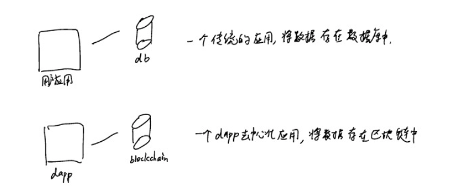
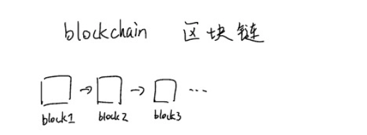
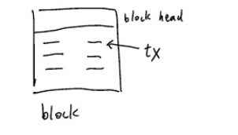
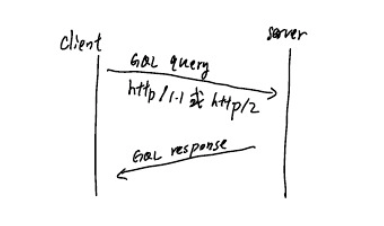
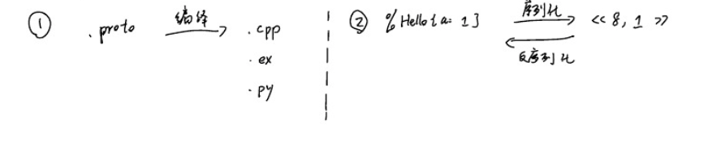
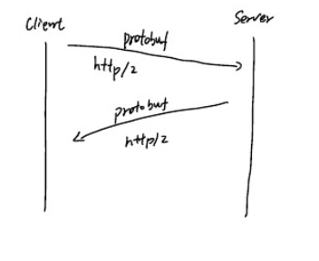
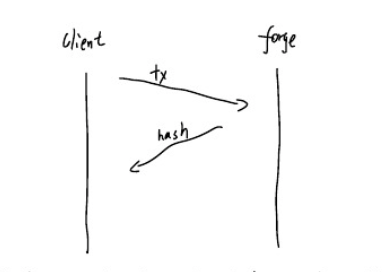
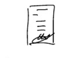
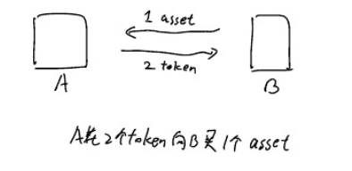
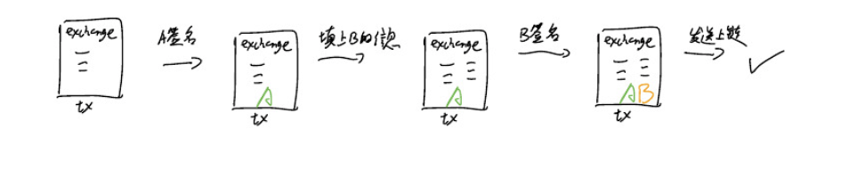

## 分享

### 什么是forge

犹如Rubyonrails是⼀一套构建web应⽤用的框架 forge是⼀一套构建区块链dapps的框架
区块链可以 简单地理解成数据库， 公开 可验证的去中⼼心化数据库 

> 

一个传统的应用把数据储存在数据库里
一个dapp去中心化应用把数据放在区块链之中，

构建⼀一个dapp⽐比较 于传统的应⽤用要复杂许多
P2P，共识算法，网络协议等⼀系列底层的架构要先搭好 ，然后才写用户逻辑来实现业务需求。
Forge作为⼀个构建基于区块链的daap框架已经做好并且提供了一套接口供应⽤程序调用。 所以对于一名应用程序的开发者，只需关心自己业务逻辑
forge会将数据保存在区块链中供应⽤程序使⽤

### 区块链是什么 

Forge中有一些概念是源于区块链的，而区块链对于很多开发者并不是很熟悉，这里简单介绍一下一些最基本的概念，以助于之后开发的理解， 

> 

区块链就是条由区块组成的链，它其实是一种数据结构。⻓的样子有点像linkedlist链表。
我们⽤用链表可以存些简单的数据 比如1，2，3 那区块链中存储的数据是什么呢， 答案是transaction
### Transation 是什么？

Transition 交易，简称为tx， 是存储在每个区块中的数据。

> 

一个区块由区块头和内容组成，头中块高，上个块的哈希等信息；而内容贼是一个个的tx。
为什么区块中的数据叫做transition交易呢？ 因为世界上第一个区块链项目比特币中，每一区块中的就是一笔笔的比特币交易记录，所以后续的各种区块链项目都用交易，即transition来作为区块链中的数据。

###Forge 中的概念 
当我们要做一个有用的应用程序时，通常会涉及到用户，用户会创建一些资产，并且将这些资产进行交易等行为。Forage 将这些行为抽象为两个基本的概念
——account账号
——asset资产

Account 就是传统应用中账户的概念，只不过，在传统应用中，一个用户账号是用用户名和密码来创建的；而在区块链的世界中，用户账号是由链包地址和私钥来创建的。

为什么不用用户名/密码来创建用户账户呢？ 因为在区块链的世界中，其实是没有一个用户登陆的概念的。我们知道，在传统的应用中，用户登陆成功后可以进行一些操作。比如说转账，发微博等。 在比特币中，用户之间是如何在不登陆账户的情况下进行转账的呢》 答案是通过**数字签名** 即将转账的交易用币比特钱包的私钥进行签名后发到区块链上；之后这个签名的交易经由别人验证后就算是有效的了，这样一笔转账的交易就算是完成了。所以**钱包**的概念也是比特币引进的。

Asset资产则用来表示任何东西，可以是一篇文章，一张图片，一张地图或是一个证书。资产可以由某个用户创建，或者应用程序来创建，一旦创建后，可以用来进行交易，使用等行为。具体是做什么是取决于应用程序。

###Forge 中的transition

前面说到，比特币中的有且仅有的一种transition就是转账，Forge 作为一个全功能框架，原生支持十几种transition，包括创建账号，创建资产，转账等。每一次时间的发上，都等价成一个个的tx发布到链上。

所以说若开发者想在区块链上做开发，归根结底就是通过forge在区块链上发布一个个的transaction。
我们知道，当forage启动之后，便是一个单独的操作系统进程，开发者开发的应用程序如何与forage交互来告之其应当发什么transaction呢？ forge 提供了两种方式，graphal 和grpc

###如何与forge 交互？
forge 本身提供了两种与其交互的形式
——graphql
——gRPC

这可能与我们平时调用某个服务器提供的API不太一样。 我们平日接解的API调用大都是通过JSOW发送一些http请求访问某个API来获取一些资源，为什么forge没有用Json API呢？

原因很简单，效率。 关于Graphql和gRPL的优点，这里不再展开，不过会简单介绍一下这二种技术。

###Graphql 怎么用？
Graphql 是facebook开源的一项技术，皆在帮助用户更高效快捷地向用户服务器获取资源，
>

Graphql 在网络的应用层面用的是http/1.1 或http/2 协议的POST请求，服务器接收从客户端发来的queny请求，经过处理后返回一个JSON的结果。

客户端能发送的请求分三类
-——query 用来读取资源
——-mutation用来创建改变资源
————subscription 用来订阅事件

在forge中，query一般用来作查询链上的数据； mutation一般用来作向链发送transition； subscription用来订阅链上发生的事件。

## gRPC怎么用？

gRpc是Google 出的一套RPC框架，简单来说，
grpc = protobuf+http/2

protocal buffer 简称protobuf， 也是google自家出的一种序列化/反序列化标准。是比XML，JSON 更加高效的序列化方式。 它是通过预先定义好一个。proto文件，记录了要传输的message都有哪些key以及它们的编号，之后序列化的时候只对value进行编码，以达到节省空间的目的，使用方法如下

>

1， 用户定义要传输的信息有哪些字段，写到一个.proto文件中，然后用官方或社区提供的你要用的语言的插件将其编译成.cpp或.ex或.py文件中。
2，在你的程序中，用刚才生成出来的模块提供的序列化函数，将一个struct转化成二进制以便在网络中进行传输，接受方用反序列化函数得到的二进制转化回struct。

用protobuf进行的对数据的序列化能很大程度上节省空间，这样传输在网络上的数据变少了，请求就更高效了。但是需要付出的代价就是

1，首先要有服务端定义的.proto文件
2，你要用的语言要有protoc（官方提供的protobuf的编译器）的插件。

forge所有用到的proto文件都在 arcblock/ forge——abi这个仓库下提供； Google官方支持c++，c#，go，python的插件，其他的语言要到社区中去找了。

那么，pRpc是啥呢 看图说话

>

——首先服务器端定义好一套请求/响应的.proto文件
——客户端把要发的请求通过protobuf 序列化成二进制后，通过http/2协议发给服务器
——服务器收到请求，处理之，然后再以protobuf序列化的二进制发回响应——客户端收到响应后，反序列化拿到结果

之所以用http/2协议而不再用http/1.1是为了能够更高效地传输数据。
同时，需要用一个官方提供的或是社区提供的gRPC的库来使用gRPC。

###Grapgql 还是gRPC？
forge 提供了Grapgql和gRPC两种方式来与其交互，那么到底用哪个好呢？
Graphql 上手简单，只需要用一个http客户端和一个Json 的原就能收发数据了，而gRpC上手复杂，需要了解protobuf,并用一个gRPC才能收发数据。
我们推荐用gRPC，虽然看起来上手难点，但是其使用起来更灵活； 而Graphql上手简单，更适合一些简单的查询。

###Forge中如何发送transition？
前面讲了若开发者想在区块链上做开发，归根到底就是通过forge在区块链上发布一个一个的transaction。又讲了forge提供Graphql和gRPC的方式来交互。接下来就讲一下如何在forge中通过gRPC中发送transaction。
>

怎么样，发送的流程简单吧！就是把forge中定义的transaction通过gRPC发给forge，之后forge会返回一个哈希作为结果。

好的，那么接下来，我们就来看一下forge中定义的transition长什么样。

Forge 中对于transaction的定义可以在arcblock/forge——abi/lib/protobuf/type.proto下面找到。

    message Transaction {
        string from = 1; 这个是谁发的，即钱包地址
        uint64 nonce = 2 ； nonce 用来防止重敌攻击，每次需要递增发送
        string chain_id =3；  tx发送至的链的id
        bytes pk = 4； 发tx的钱包的公钥
        bytes signature = 13； 发tx的钱包的签名
        repeated mulitisly signatures = 14； 多方签名
        google. protobuf.Any itx=15 ；inner transaction ，这个t具体是干啥的。 

    }
我们需要做的事情就是构造出来这个transaction后，将其发送给forge，接下来我们会用一个具体的例子来演示如何在链上创建一个钱包账号。

###Forge 中的钱包
创建钱包分2步，
1，在本地创建一个钱包
2，把这个钱包申明（decleare）到链上去，这样就算完成了用户账号的创建。
所以说了这么久，钱包究竟是什么东西呢？
钱包其实就是一个存储了公钥/私钥/地址的一个数据结构，被定义于protobuf中，

    message walletinfor{
        bytes
        sl = 2;私钥
        bytes pk =3； 公钥
        string address = 4； DID地址
    } 

我们的钱包是一个支持DID规范的钱包，里面有3个选项可选
—— role—type 角色
—— key—type 私钥算法
—— hash-type 哈希算法

    message WalletType{

        keyType key= 1;
        HashType hash =2; 
        EncodingType address = 3;
        RoleType role =4;
    }

这里的细节请参考 arcblock/ abt-did-spec 里面关于创建DID的文档

以下的参考代码内为Elixir代码，用的是我们已经开源的forge-elixir-sdk的库

wallet-type = ForgeAbi。WalletType。new （role：：role_account， key：：ed25519，hash：：sha3）
wallet = ForgeSdk。Wallet。util。create（wallet-type）
       
     %forgeABi.WalletInfo{
         address： "z1mwolwq...." 
         ##DID地址，里面包含了私钥类型，哈希算法及角色

         pk：《85，199....》
         ##公钥，32字节
         sk：《19，21，248，....》 
         ##私钥，我们用的ed25519，私钥地址包括了公钥，共64字节。

    }

好的，这样我们创建的钱包已是在本地创建的，还苏耀把它申明到链上去，
还记得之前说的，要在链上搞事情就得需要发一个transaction。
        
        message Transaction{
            string from 1;
            uint64 nonce = 2;
            string chain_id =3;
            bytes pk=4 ;
            bytes signature =13;
            repeated Mulitisky signatures = 14;
            google. protobuf.Any itx =15
        }
还剩下 signature， signatures heitx未填， signaures是多方签名，我们这一步还用不到，不用管它，在看签名之前我们先来看一下itx。

## forge 中的itx是什么?
itx 是inner transaction的缩写，都已经有了tx，为啥还要有itx呢？
>

做个比喻，这个就像写信一样，每封信都有标题，抬头，征文，日期，和签名等，但是不同的信的征文内容是不同的。
tx就是信的模版，包括寄信人，标题，签名；而itx则是信的正文，代表了具体内容。forge只吃了十几种tx，也就是说，有十几种itx。
我们要做的就是将刚创建的钱包中申明上的链的itx叫做declare

        message DeclareTx{
            string moniker =1 ;  ##表示这个钱包账户的别名
            ....
        }

这里忽视了其他一些用不上的字段。
那么如何将这个declare tx 创建成一个itx呢？ 我们再来看一下transaction中定义的itx类型
        
        google.protobuf.Any itx = 15;

它的类型是google.protobuf.Any, 这个是google提供的一种类型，如它的名字一样，是专门给任意类型用的一种通用的类型，它的定义如下

        message Any{
            string type-url =1;
            bytes value =2;
        }
既然是任意类型，那只用value来表示不就好了吗？ type-urt 是个什么鬼？ 这个其实是给应用程序用的，告诉它这个任意类型到底是个什么类型。google射击的本意是这个type-url是一个url， 但是我们并不需要它是一个url，可以在任何字符串forge中定义的type-url长这样
        
        fg：t：declare
        forge缩写 type itx类型
        declare = ForgeAbi. OeclareTx。new（moniker：“Johnson”）
        value = ForgeAbi.DeckclareTx.encede(declare)
        itx = Google.Parte.Any.new(type-url:"fg:t:declare",value:value)
        %Google.Proto.Any{type-url:"fg:t:declare",value:"lnlajonsnow"} ##lnlajonsnow就是用protobuf编码的declare itx

好，现在再看一下我们的tx
        
        message Transaction {
            string from = 1; ##wallet.address
            uint64 noncew =2; ##1
            string chain_id =3; ##forge
            bytes pk=4; ##wallet.pk
            bytes signature = 13;
            repeated Multisly signatures =14;
            google.protobuf. Any itx = 15;

        }

现在就差最后一步，签名了。

###forge中如何给tx签名？

forge 中的钱包支持2中椭圆形区间数字签名算法，ed25519和secp256看
。所谓的数字签名就是用钱包的私钥对tx的哈希做一个签名，之后别人可以用其公钥进行验证。
        signature = sign（data，sk）
        data 为tx序列化后的二进制哈希
        sk这里是钱包的私钥

        hash = mcrypto.hash (%sha3{},ForgeAbi.Transaction.encode(tx))
        sig =Mcrypto.sign!(%Ed25519{},hash,wallet.sk)
        tx = %{tx|signature :sig}

至此，我们的tx终于算是构造完成并且签好名了！ 接下来只需要把这个tx发送给forge啦！

###如何向forge发送tx？

因为我们用gRPC与forge进行交互，所以我们只需要拍使用一个gRPC提供的发送tx的服务就行了，这个服务在forge中叫send-tx，定义在arcblock/forge-abi/lib/protobuf/servoce.proto中。
进行这项操作需要参考你所用的语言的gRPC的库的文档，在Elicir中，这样做
        Forgesdk.send-tx(tx:tx)
        "48c265bb...."

之后返回的哈希即是这个tx在链上的哈希喽！用这个哈希就可以在链上查到其状态了。当我们把tx发送请给forge后，forge会做一系列的检查，包括发送tx的钱包地址是否有效，签名是否有效等。之后forge会把这个tx发送给下层的共识引擎，并且广播到DID网络中，最后会被打包到新的区块中，这样子我们发的tx相当于成功上链啦！ 当然上链并不代表这个tx就是成功了的，还需要检查这个tx的状态才行哦。

###forge中常用的tx

方才我们学习了如何构建并签名一个declare tx， 并且成功将其发送给forge，这样我们就成功地在forge上创建了一个钱包账户，接下来我们来看一下，forge中有那些常用的tx。

假设有如下场景
用户a创建了一个账户后，签到一次得到一些token，之后创建了一个资产（游戏地图），
并将这个资产免费转让了另一用户b，之后用户a用一些token向用户b购买了该资产，完成了一次交换。

declare 之前我们已经看过了，接下来看poke。

## poke tx

poke 就是戳一下，作用是签到领取25个token，一天只能领取一次。
我们知道，发送tx时，tx的结构都是一样的，不同的仅仅是itx的内容及签名。我们再来看一下tx的结构。

        message Transaction{
            string from =1 ; ##wallet.address
            uint64 nonce = 2; ## 0 <-   注意对于poke来说nonce要用o
            string chain_id =3； ## forge
            bytes pk=4； ## wallet.pk
            bytes signature =13;
            repeated Multisly signatures =14;
            google.protobuf.Any itx =15; ##itx <-改用poke tx
        }

poke tx 的定义如下
        message PokeTx{
            string data =1;  ## 签到的日期，用当天
            string address =2； ##向哪个钱包地址签到，这个是固定的地址，“zzzzz..”(36个z)

        }

        poke = ForgeAbi. PokeTx.new(data:"2019-05-28",address:"zzzzzzz...")
        value = ForgeAbi.PokeTx.encode(poke)
        itx=Google.proto.Any.new(type-url:"fg:t:poke",value:value)%Google.proto.Any{type-url:"fg:t:poke",value:<<10,10,50,...>>}

然后把这个itx塞到上面的tx中，签名之后，发到链上吧！

        forgesdk.send-tx (tx:tx)
        "66313AFB...."

成功以后去链上查询一下，此时我们的jonsnow常昊就多了25个token啦！
好的，现在我们的钱包创建了，并且有了25个token，接下来看看如何创建一个资产

##create_asset tx

asset 表示资产，可以代表任何可交易的物体，这里我们用游戏地图举例子，先看看create_asset的定义

        message createAssetTx{
            string moniker = 1; ##这个资产的别名
            google.protobuf.Any data=2;
            bool readonly=3;
            bool transferable=4; ##是否可转让
            uint32  ttl=5;
            string parent=6;
            string address=7; ##资产地址
        }

这里定义了7个字段，我们只关心其中4个，其余的可以不管。

        map = %Google.Protobuf.Any{value:"thisb is my map}
        asset = forgeAbi.CreateAssetTx.new(transferable:true,moniker:"map1",data:map)
接下来还有asset中的地址为空，我们需要自己将它算出来。
forge中的所有东西的id都是支持DID标准，对于asset的地址，也是一个DID。那么asset地址怎么算呢？

        hash = mcrypto.hash(%sha3{},forgeAbi,createAssetTx.encode(itx))

        之后的步骤请参考abt-did-spec文档中的步骤，这里算出的哈希作为第5步的输入。并且在选role-type时要选asset。

地址算好后填到上面的asset中

        value = forgeabi.createAsseTx.encode(asset))
        itx = Google.proto.Any.new(type-url:"fg:t:create-asset",value:value)
        %Google.proto.Any{type-url:"fg:t:create_asset",value:<<10.4.109....>>}

接下来的步骤就是流水线作业，将：tx塞入tx中，签名，发送
成功后，一个asset就创建好了！里面的内容放的就是“this is my mao”.
ok, 接下来我们要把该资产转移给另一个账户，这会用到transfertx

###transfer tx

转让transfer是一个单方面的用户行为。用户可以向用户b转钱或者转资产，所以我们需要先创建第二个钱包

        wallet_type = ForgeAbi.Wallettype.new(role::role_account,key:ed25519,hash:sha3)

        wallet2 = Forgesdk.Wallet.util.create(wallet-type)

之后用declare tx将其声明到链上去，这里就不再详写了。

接下来看transfer tx的定义

        message TransferTx {
            string to = 1; ##目标钱包地址
            BigUint value =2; ##给多少钱
            repeated string assots =3; ##有哪些资产

        }

我们这里只转让一个刚才创建的地图资产，只需要asset地址即可。

        map1 = “ejdqnc...”
        transfer = ForgeAbi.TransferTx.new(to:wallet2.address,assets:[map1])
        value = ForgeAbi.TransferTx.encode(transfer)
        itx = Google.Proto.Any.new(type-url:"fg:t:transfer",value=value)
        %Googel.proto.Any{type-url:"fg:t:transfer",value:<<10,35,122,...>>}

之后老套路，itx放入tx中，签名，发送上链
成功之后，本来属于用户A的资产现在就属于用户B了！
最后来看一下exchange tx。

###exchange tx
之前所有讲过的tx都只需要一个签名，而exchange tx则需要两个签名，因为是交换资产所以需要交换的双方都同意才行。

>

看一下exchange tx的定义

        message Exchange {
            string to =1; ##与哪个地址交换
            ExchangeInfo sender =2; ##发送人信息
            Exchangeinfor receiver =3; ##接受人信息

        }
        message Exchangeinfor{
            BigUint value =1 ; ##交换的金额
            repeated string asets =2; ##交换的资产
        }
        message bigUint{
            bytes value =1; ##因为金额是大整数，所以我们用bytes来表示

        }

构建一下itx

        exchange =ForgeAbi.ExchangeTx.new(to:wallet2.address,
        sender:Forge.Exchangeinfor.new(value:ForgeAbi.token.to.uint(2)),
        receiver:ForgeAbi.ExchangeInfo.new(assets:imap1))

        value = ForgeAbi.ExchangeTx.encode(exchange)

        itx=Google.Proto.Any.new(type-url:"fg:t:exchsange",value:value)

接下俩老套路，itx放进tx，签名
至此，我们的tx还差最后一步，也是我们之前一直没用过的Multisig多方签名

        Message Transaction{
            string from =1; ##walle.address
            uint64 nonce=2; ##1
            string chain.id = 3; ##forge
            bytes pk = 4; ##wallet.pk
            bytes signature = 13; ##signature
            repeated Multisig signatures =  14;
            google.protobuf.Any itx=15; ##itx
        }

看下multisig 的定义

        message multisig{
            string signer =1 ; ##用户的地址
            byte pk =2；##用户b的公钥
            bytes signature =3； ##用户B的签名

        }

这个multisig该如何构建呢？很简单 将用户b的地址和公共、钥匙、填入，再塞进tx中，然后用户b签名就行啦！

        mulitisig = ForgeAbi.multisig.new(signer: wallet2.address,pk:wallet2.pk) ##创建一个mulitisig的map
        tx = %{tx|signstures:Imultisig]} ##将其放入tx的signatures字段中，注意现在这个mulitisig的签名还是空哦

        signature = Forgesdk.wallet.util.sign!(wallet2,ForgeAbi.transaction.encode(tx))将这个tx让用户B签名
        multisig = %{nulisig | signature :sigbature }##签好之后把签名设入mulitisig的map中
        tx = %{tx|sigbatures:I multisig}##最后将签名的multisig放入tx中

至此，我们的tx就被用户A和用户B都签名了，可以发送的链上去了！
成功后，资产被转移到A的名下，A支付给b两个token，交换成功！

整个流程的图示

>